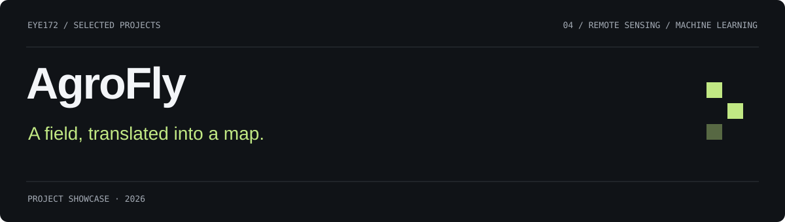
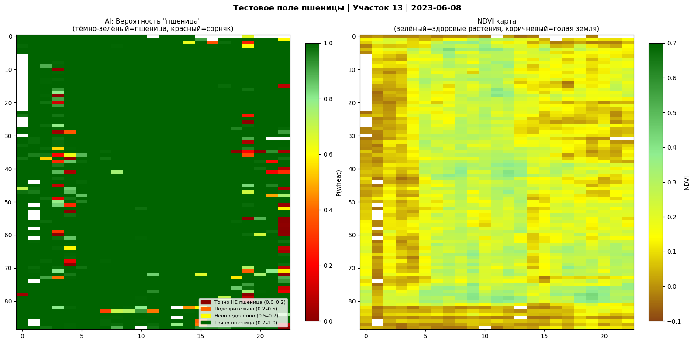
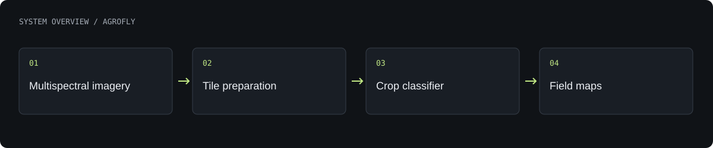

# AgroFly

Drone-assisted crop analysis combining multispectral image experiments, field-map inference and a precision-agriculture product concept.

**Research and engineering prototype · currently paused**

[What is built](#what-is-built) · [Architecture](#architecture) · [Authors](#authors) · [Profile](https://github.com/Eye172)

## Product gallery

Recorded training and validation history.

More screenshots and project visuals

Inference on a held-out wheat plot from the same field and season.

The scout-drone prototype.

## What is built

- Train a six-channel ResNet18 on multispectral crop tiles.
- Run field-scale inference to produce probability and NDVI maps.
- Inspect model behaviour using training curves and held-out examples.
- Present the drone and analysis workflow through an interactive concept website.

## Architecture

The ML workflow prepares six-band image tiles, trains a classifier and combines tile predictions into spatial outputs. A separate website presents the precision-agriculture concept. The physical scout-drone prototype and the experimental dataset use different sensing setups.

**Technology:** Python · PyTorch · ResNet18 · NumPy · OpenCV · React · TypeScript · Three.js.

## Current scope

The recorded 99.75% validation accuracy used a random tile split, not an independent field. This is wheat/soybean classification, not validated weed or disease detection. Synthetic field demonstrations are labelled; autonomous spraying is a concept.

## Authors

[Shakhnazar Akhmer](https://github.com/Eye172) and **Bauyrzhan Nurali**.

## About this repository

This is a standalone project showcase containing a product description, visuals and a high-level architecture overview. Implementation source, model weights, credentials and internal project materials are not distributed here. No deployment is required to explore this page.

[Contact](mailto:shakh090909@gmail.com) · [GitHub profile](https://github.com/Eye172)
