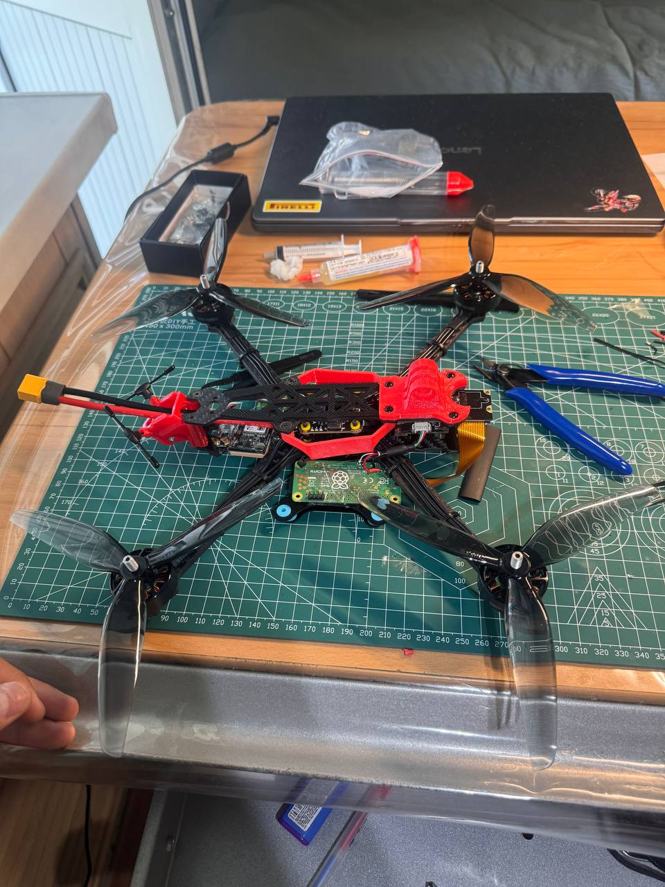
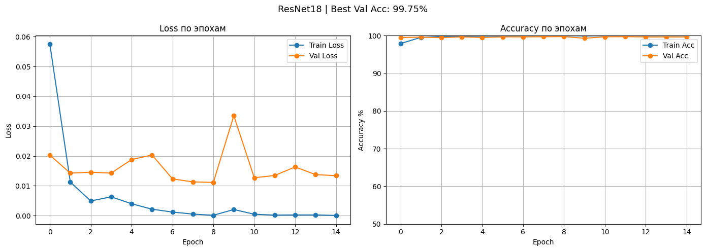

# AgroFly
### Turning multispectral observations into a readable field map.

A precision-agriculture investigation spanning a scout-drone build, crop classification experiments and a product concept for field analysis. The work connects hardware constraints to an ML pipeline instead of treating the drone as a decorative part of an AI demo.

*The physical scout-drone build documented during the project.*

## The question behind the prototype

Can aerial observations become a map that helps someone inspect what is growing in different parts of a field? AgroFly explored that question through a bounded first experiment: distinguishing **wheat and soybeans** from multispectral image tiles. Weed detection, disease diagnosis and autonomous spraying were not established by this classifier.

The project was split into a sensing platform, a training pipeline and a field-level presentation. This separation matters: a promising result on a supplied dataset does not automatically transfer to a different camera mounted on a drone.

## Start with all six bands

The experiment uses six-channel imagery. A conventional image classifier expects three colour channels, so the ResNet-18 input was adapted for the available multispectral bands. Tiles preserve the spectral channels together; the model learns from the combined observation rather than classifying a screenshot of a rendered map.

*The six-band dataset view: these are the model inputs, not six independent photographs.*

The training workflow prepares labelled tiles, fits the classifier and records learning curves. The resulting predictor is then applied across a larger field arrangement so that local predictions can be inspected spatially. A field map makes obvious errors easier to notice than a single aggregate accuracy figure.

*Recorded training and validation curves from the crop-classification experiment.*

## Accuracy needs a spatial explanation

The documented random-tile experiment reported **99.75% accuracy**. Nearby tiles can share soil, illumination, crop stage and capture conditions, so that number should not be read as independent-farm performance. A held-out plot is a stronger check than random tiles from the same capture, but it still shares a field and season with the source data.

*Held-out wheat plot 13. This checks a withheld plot within the available field/season, not a new farm or sensor.*

The synthetic field test serves a different purpose: it exercises the end-to-end mapping and visualization workflow using a constructed field arrangement. It is useful for checking the pipeline and presentation, but is not evidence of deployment accuracy.

*Explicitly synthetic field test used to inspect map inference and presentation.*

## From capture to a map

~~~mermaid
flowchart LR
 A[Multispectral dataset] --> B[Aligned six-band tiles]
 B --> C[Adapted ResNet-18]
 C --> D[Tile predictions]
 D --> E[Spatial field visualization]
 F[Scout-drone hardware] -. sensor and domain gap .-> A
~~~

| Layer | What was built | What it demonstrates |
|---|---|---|
| Hardware | Scout-drone assembly and sensing investigation | A physical platform and its integration constraints |
| ML | Six-channel crop classifier | A bounded wheat/soybean discrimination experiment |
| Analysis | Training curves and held-out-plot inspection | Visibility into learning behaviour and spatial generalization |
| Presentation | Field maps and a product website | How a prediction could become a useful field view |

**Technology:** Python, multispectral image processing, PyTorch / ResNet-18, field-map inference and drone hardware. The product website is separate from the experimental model.

## What remains open

The drone sensor and training dataset are not interchangeable. A deployment would need matching calibration, field collection and evaluation across locations and seasons. Spraying is a product direction, not a capability demonstrated by the crop classifier. The project is currently paused; the material here documents the build and experiments completed so far.

The central lesson was practical: the quality of a field-analysis system depends on the relationship between sensor, dataset and evaluation split. A high number without that context says very little about what will happen over a new field.

---

### Built by

[Shakhnazar Akhmer](https://github.com/Eye172) and **Bauyrzhan Nurali**.

[More projects](https://github.com/Eye172) · [Contact](mailto:shakh090909@gmail.com)

This repository presents the product and its engineering. The implementation is maintained separately. Screenshots and documented experiments are identified in their captions; a live deployment is not required to explore the case study.
